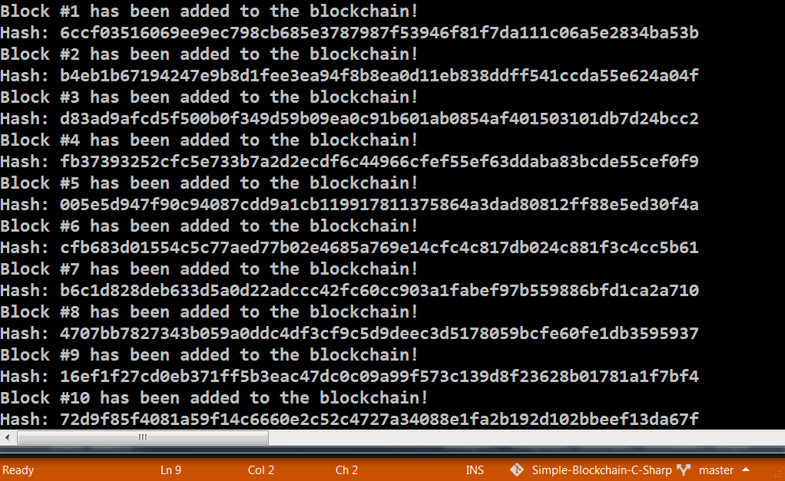

# ⛓ Simple-Blockchain ⛓
This is a C# port from ([Python code](https://medium.com/crypto-currently/lets-build-the-tiniest-blockchain-e70965a248b)).

It uses **SHA-256** as **Hash**, I slightly modified the code from the tutorial to get a random string with the System.Security.Cryptography library.

## 🖥 What you can learn from the Code 🖥

- Simply how a **Blockchain** works
- What a **Hash** is, in the context of Blockchain Technologies
- How to use the **Blockchain** in applications 🖥

## 🖼 Example 🖼

